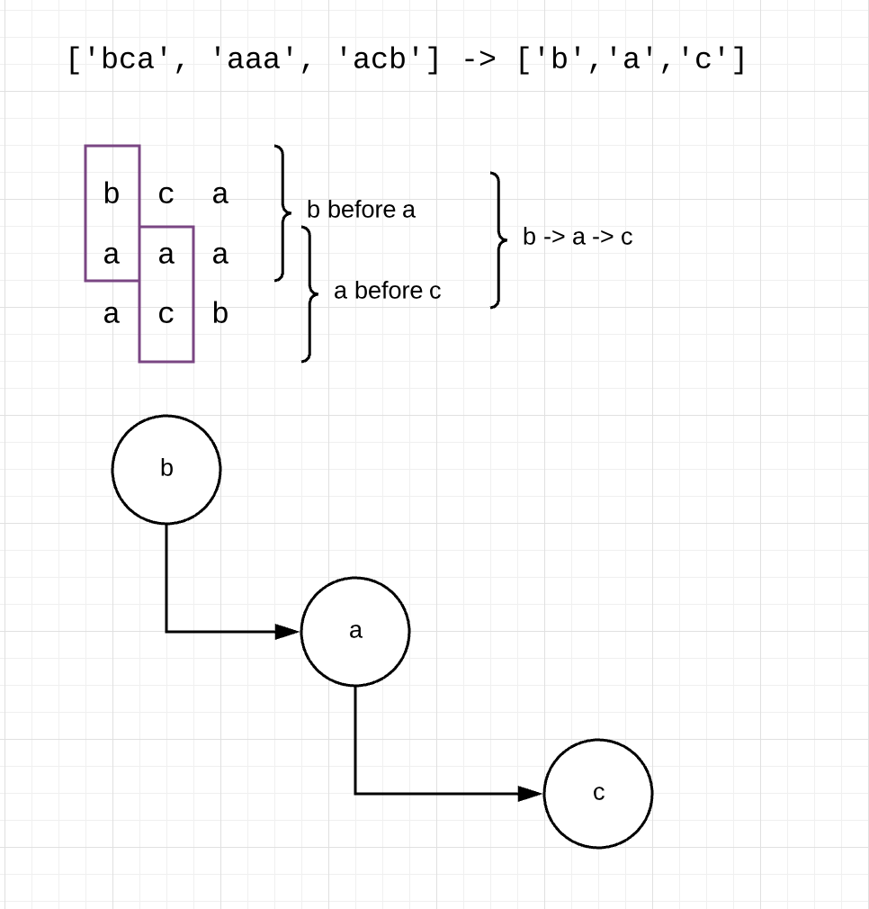
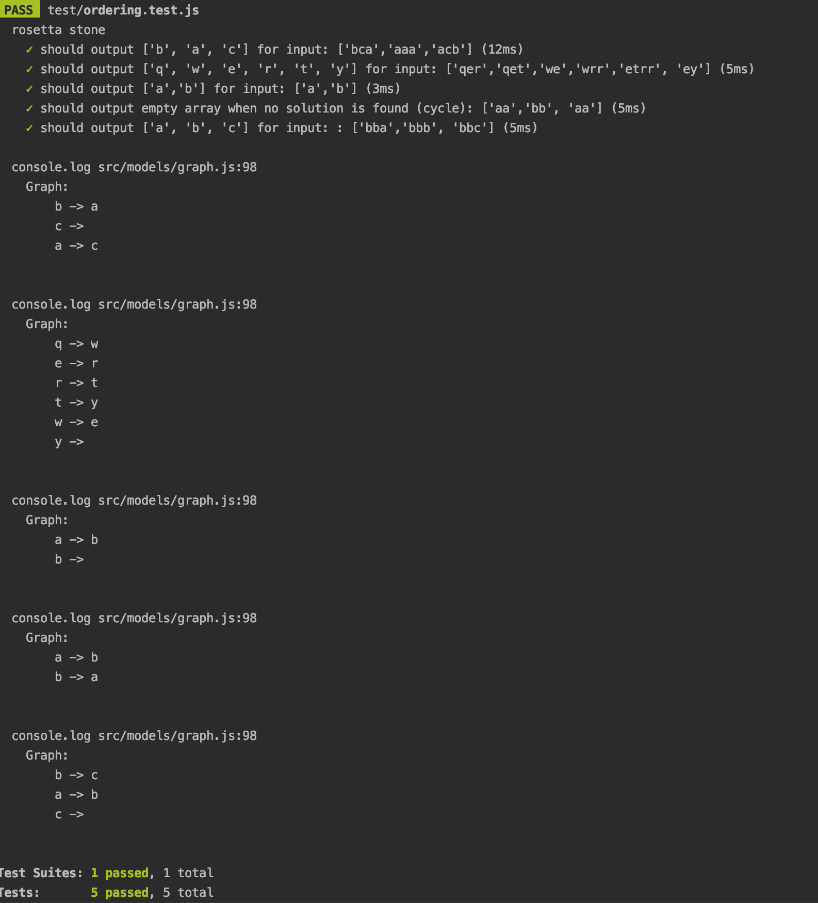
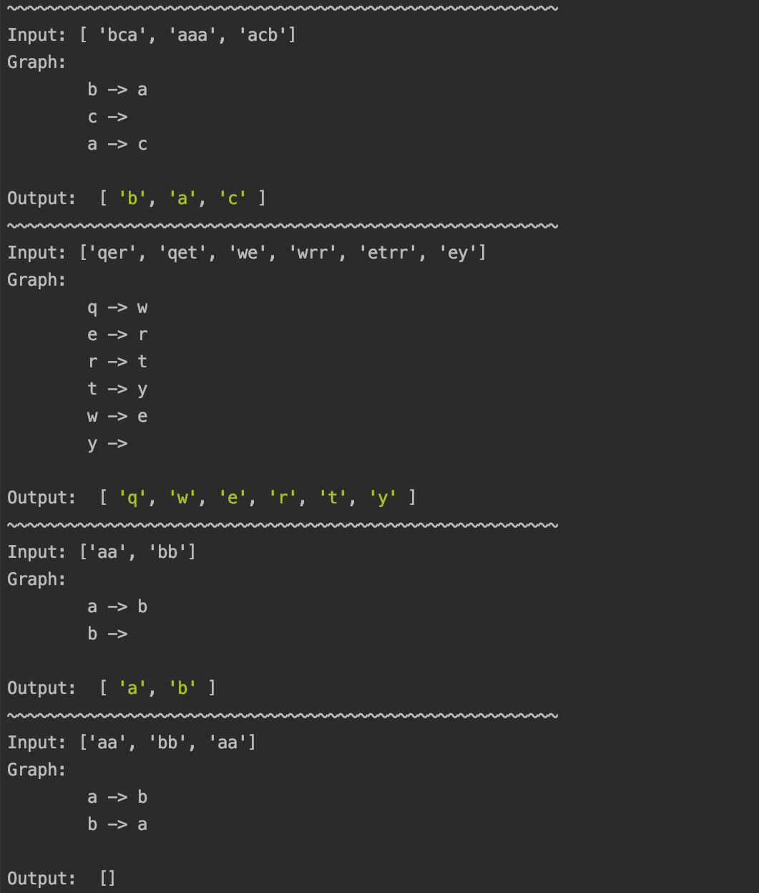
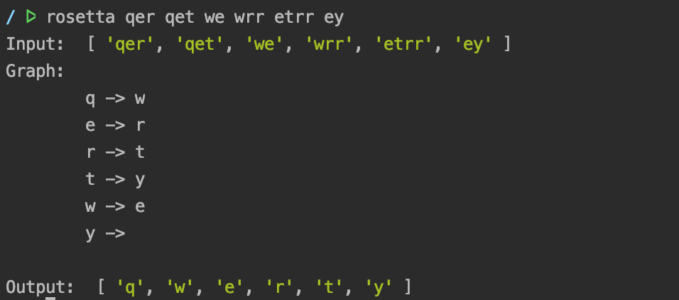

# Rosetta Stone Project

## Overview

You are given a list of words sorted in alphabetical order. The only issue is that this alphabet isn’t English. Can you determine the ordering of the alphabet?

Note that you can assume the list of words will have enough information to derive the complete order of the alphabet.

Input: ['bca', 'aaa', 'acb']

Output: [‘b’, ‘a’, ‘c’]  

## Assumptions

1. All letters are in lowercase and ASCII characters.
2. Input is always valid.
3. Multiple orderings are not possible.

## Analysis



## Running the project

1. Clone the project and run ```npm install```
2. Run tests: ```npm test```



3. Run script: 
         
   * first time only: ```npm link```
   
   * with no arguments: ```rosetta```
   
   
   
   * with arguments (separated by space): ```rosetta a b a```
   
   
   
Note: Running the script without arguments will output same cases as the tests. 